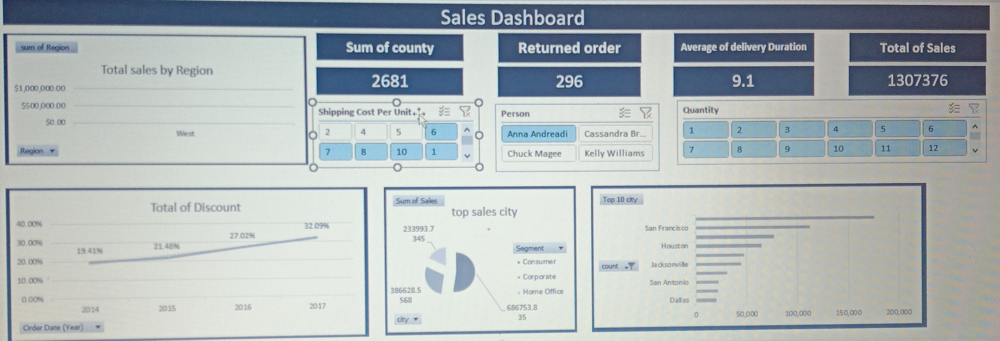

# 📊 Sales Dashboard – Excel

An interactive **Sales Performance Dashboard** built in Microsoft Excel using the **Kaggle Superstore Dataset**.

---

## 🎯 Project Overview

This dashboard analyzes sales data across regions, cities, customer segments, and time periods to uncover business insights and track key performance indicators.

---

## 📌 Key Metrics (KPIs)

| Metric | Value |
|---|---|
| 💰 Total Sales | $2,356,939 |
| 📦 Total Counties | 2,323 |
| 🔄 Returned Orders | 296 |
| 🚚 Avg. Delivery Duration | 11.2 days |

---

## 📈 Dashboard Features

- **Total Sales by Region** — Bar chart comparing regional performance
- **Total Discount Trend** — Line chart showing discount % from 2014–2017
- **Top Sales Cities** — Pie chart of highest revenue cities
- **Top 10 Cities** — Horizontal bar chart ranking cities by order count
- **Shipping Cost Per Unit** — Filter-based analysis
- **Customer Segments** — Consumer, Corporate, Home Office breakdown
- **Interactive Slicers** — Filter by Region, Segment, Person, Quantity

---

## 🗂️ Sheets Structure

| Sheet | Description |
|---|---|
| Sales Dashboard | Main interactive dashboard |
| Sales Dashboard2 | Secondary view |
| pivot table | Pivot tables powering the charts |
| people | Sales representatives data |
| Shipping Cost | Shipping cost analysis |
| return | Returned orders data |

---

## 🛠️ Tools & Skills Used

- Microsoft Excel
- Pivot Tables & Pivot Charts
- COUNTIF, SUM formulas
- Slicers & Filters
- Data Visualization
- KPI Cards

---

## 📁 Dataset

- **Source:** Kaggle – Superstore Sales Dataset
- **Period:** 2014 – 2017
- **Records:** ~10,000 rows

---

## 👤 Author

**Omar Ahmed Mehany**
[LinkedIn](https://linkedin.com/in/omar-ahmed-mehany46b710288) · [GitHub](https://github.com/omarmehany28-cpu)
